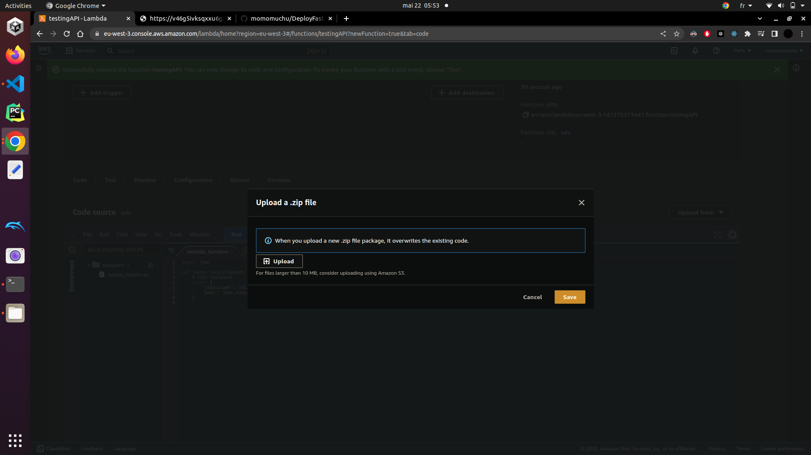

# DeployFastApiAwsLambda


This repository contains a FastAPI API deployed on AWS Lambda using Mangum.

## Step 1: Create API using Mangum


To create the API, we utilize the Mangum package for AWS Lambda integration. The FastAPI app is defined in the `main.py` file.

## Step 1.5: Go to AWS Lambda




Start the lambda function


## Step 2: Create the Zip File

To package the code for deployment, follow these commands:

```bash
pip install -t lib -r requirements.txt
(cd lib; zip ../api.zip -r .)
zip api.zip -u main.py
```

## Step 3: Test the Code


After deploying the code to AWS Lambda, test the API using the provided endpoints. You can use tools like curl, Postman, or directly access the API endpoints.


## Step 4:   Create a URL using the URL configuration


Step 4: Optional - Create a URL using the URL configuration
Step 4

If desired, configure a URL for the API using services like AWS API Gateway. This step enables you to expose the API through a public URL.


Step 5: Enjoy Your Work!
Step 5

Congratulations! Your FastAPI API is now deployed on AWS Lambda and ready to be used. Enjoy the benefits of serverless architecture!

For more information on FastAPI and Mangum, refer to their respective documentation.


In this version, steps 2 and 3 are combined into a single code block, providing instructions for creating the zip file and uploading it to AWS Lambda. The images for step 2 and 3 are placed accordingly.


